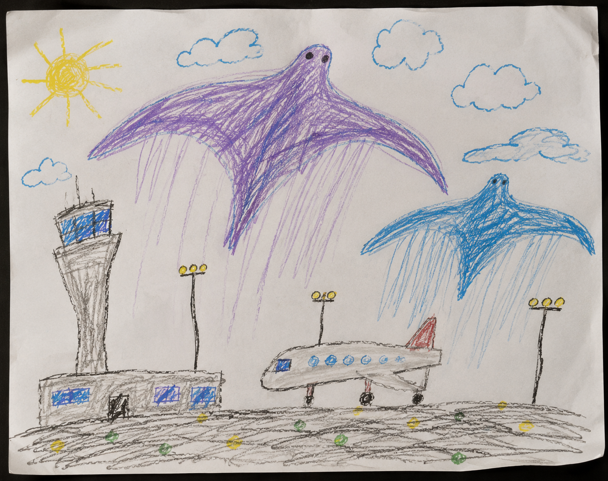

# H-08 — Owen Walker's Drawing

**Recovered During**

NTSB witness interview with Sarah Walker and Owen Walker.

**Description**

Crayon drawing produced by Owen Walker depicting his recollection of the O'Hare incident.

